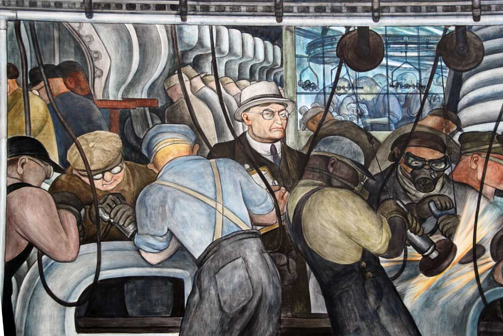

<figure>
    
    <figcaption style="text-align: right;color:grey;">North wall, Diego Rivera, <em>Detroit Industry murals</em>, 1932-33, twenty-seven fresco panels at the Detroit Institute of Arts</figcaption>
</figure>

<!-- Container for the image gallery -->

  <!-- Full-width images with number text -->
  

    
1 / 4

      
  

  

    
2 / 4

      
  

  

    
3 / 4

      
  

  

    
4 / 4

      
  

<!-- 
  

    
5 / 6

      
  

  

    
6 / 6

      
  

-->
  <!-- Next and previous buttons -->
  <a class="prev" onclick="plusSlides(-1)">&#10094;</a>
  <a class="next" onclick="plusSlides(1)">&#10095;</a>
  <!-- Image text -->
  

    

  

<!---

--->

## Topics of interest

The workshop invites **technical as well as non-technical** submissions, which encompass experimental, theoretical or methodological contributions. We explicitly welcome interdisciplinary submissions that explore the **use of AI and its social, economical and political implications**. The topics of interest include, but are not limited to:

* The nature of AI in the context of technological paradigms.
* The economics of AI: business strategies, industry, finance, distribution.
* The impact of AI and digital platforms on the quantity and quality of labour.
* The impact of AI on society, behaviour and interactions.
* Case studies of work organisation and control of labour using AI.
* Labour relations, rules and conflicts at the time of AI.
* Military vs civilian trajectories of AI and digitalisation.
* Algorithmic management: how the role of code impact the working conditions of digital workers.
* Unpacking black-box socio-technical systems: revealing the technical roots of socio-economic vulnerabilities.
* The materiality of AI: assessment and mitigation of environmental and human costs of AI. Are sustainable futures for digital societies attainable for all? 
* From AI to Generative AI: a paradigm shift in the digital economy?

The workshop encourages methodological plurality; hence, submissions based on different research designs and methods are welcome, spanning data science, social sciences, and interdisciplinary approaches. Proposals may include papers presenting robust empirical research, or papers that showcase ongoing work and novel frameworks for comprehending and analysing AI systems in the context of labour and society.

## Submission instructions
We welcome the following types of submissions:

* **Full original research paper** that presents original, impactful work (10 to 12 pages).
* **Working papers** that present work in progress (5 to 9 pages).
* **Blue sky papers** that present visionary ideas to stimulate the research community (5 to 9 pages).
* **Extended abstracts** describing early-stage research and **research communication** of already published papers that serves to promote the dissemination of contributions aligned with the scope of the workshop (up to 4 pages);  

All paper lengths exclude references, which are unlimited. All submissions should adhere to the [CEUR-WS proceeding guidelines](https://ceur-ws.org/HOWTOSUBMIT.html) and be uploaded on [Easychair](). Authors should submit their papers as single-column, using one of the following templates:

* [Overleaf](https://www.overleaf.com/latex/templates/template-for-submissions-to-ceur-workshop-proceedings-ceur-ws-dot-org/wqyfdgftmcfw) template in LaTeX format.
* [Word](https://ceur-ws.org/Vol-IAOA/CEUR-Template-1col.docx) template.
* [ODT](http://ceur-ws.org/Vol-XXX/CEUR-Template-1col.odt) template.

These templates can also be downloaded as an offline version with the style files [here](http://ceur-ws.org/Vol-XXX/CEURART.zip).

Submissions are double-blind (i.e., submissions must not include the author’s names and affiliation) peer-reviewed by at least two members of the program committee and evaluated on the basis of relevance, originality, significance, soundness, and clarity. Papers that exceed the page limits or formatting guidelines will be returned without review. At submission time, authors will have to indicate the contribution type. Accepted papers will be presented at the workshop through oral presentations, lightning talks or posters. Hence, we require that at least one author of each accepted paper registers for either the conference or the single-day workshop (*TBC*). 
Moreover, accepted contributions will be collected into a volume of the HHAI 2025 Workshop and Tutorial proceedings under [CEUR-WS](https://ceur-ws.org/HOWTOSUBMIT.html) or submitted to special issues of pertinent scientific journals (*TBC*).

The workshop seeks to achieve global and diverse participation. With an effort towards equitable conversations, we invite contributions from marginalised perspectives and communities in AI.      

## Important dates

Tentative timeline:
* **Paper submission**: April 11, 2025
* **Acceptance notification**: May 2, 2025
* **Camera-ready version**: May 12, 2025
* **Workshop**: June 9 or 10, 2025 *(TBA)*